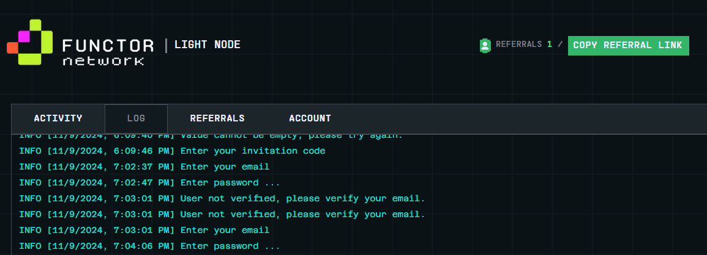

# Functor Network Auto checkin


**Functor Network** before start the script you must have account in [functor network](https://node.securitylabs.xyz/?from=extension&type=signin&referralCode=cm3bogpzf043ojp1bbgloh6mm)
- Register to functor network [https://node.securitylabs.xyz/](https://node.securitylabs.xyz/?from=extension&type=signin&referralCode=cm3bogpzf043ojp1bbgloh6mm)
- Insert invite code : `cm3bogpzf043ojp1bbgloh6mm`
- Save your email and password 

# How to run 
## clone the repository
```bash
git clone https://github.com/nongdancryptos/Functor-Bot.git
cd functot
```
## install the requirements
```bash
npm install
```
## fill your email and password in `account.txt`
```bash
email,pass
```
## fill your proxies in `proxy.txt`
```bash
http://user:pass@ip:port
```
## run the script
```bash
npm run start
```
## Donations

If you would like to support the development of this project, you can make a donation using the following addresses:

- **Solana**: `3rYhoVL8g28iwjGQq8hKw4bvVmBGhyC8DEbKAwzmy4wn`
- **EVM**: `0x431588aff8ea1becb1d8188d87195aa95678ba0a`
- **BTC**: `bc1pu30mhlegcajqq23ff30vrlnlnsmv0ha6ufwaenv0em4ap8dfzyrqwsvjx5`

## Contributing

Feel free to open issues or submit pull requests if you have improvements or bug fixes.

## License

This project is licensed under the MIT License. See the [LICENSE](LICENSE) file for details.
